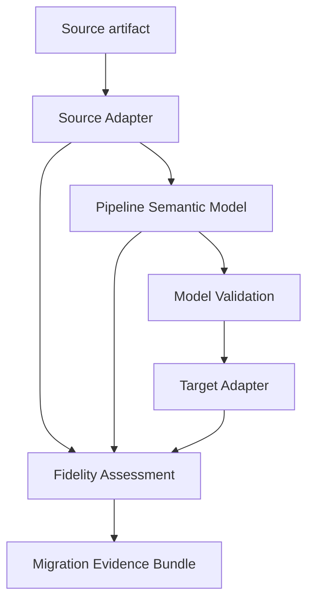

# ETLIR

**Platform-neutral pipeline semantics, translation, and migration evidence.**

> Data-flow logic is enterprise intellectual property. Platforms should execute it, not own it.

ETLIR is an early-stage open-source framework for representing data-pipeline behavior in a
versioned, platform-neutral model, translating that model through explicit adapter contracts,
and producing evidence about what the translation preserved, approximated, could not support,
or left for human review.

ETLIR is not an execution engine and does not claim that generated code is automatically
equivalent to its source. It makes translation decisions inspectable and prevents unsupported
behavior from disappearing silently.

## Why code conversion is not enough

A migrated pipeline can run and still behave differently. A target implementation may omit an
error path, change a comparison, alter null handling, ignore an external operation, or replace an
ordered lookup with an unordered one. Limited tests can miss those differences.

ETLIR treats migration as an accounting problem as well as a generation problem:

- Every source operation must map to a model element or a structured diagnostic.
- Every model operation must map to a target artifact location or a structured diagnostic.
- Missing accounting is itself a blocking error.
- Both machine-readable and human-readable evidence are produced for every completed run.

## How it works



The neutral model is governed by the versioned specification in [`spec/`](spec/). The Python
package under [`src/`](src/) is one reference implementation of that specification.

## v0.1 vertical slice

The first slice intentionally stays narrow:

- **Source:** ExampleFlow v1, a fictional JSON pipeline format created for this repository.
- **Model:** Pipeline Semantic Model v0.1.
- **Supported operations:** read, filter, derive, and write.
- **Target:** DuckDB SQL.
- **Evidence:** JSON plus Markdown, including operation-by-operation dispositions.
- **Failure example:** an external HTTP operation that DuckDB SQL cannot preserve.

ExampleFlow is synthetic. It does not reproduce or imitate any employer, client, or commercial
platform format.

## Quick start

```bash
python -m venv .venv
source .venv/bin/activate
python -m pip install -e ".[dev]"

etlir translate \
  --source exampleflow \
  --target duckdb \
  examples/retail-orders/source.exampleflow.json \
  --output build/retail-orders
```

On Windows PowerShell, activate the environment with:

```powershell
.venv\Scripts\Activate.ps1
```

A successful run writes:

```text
build/retail-orders/
├── pipeline-model.json
├── target/
│   └── pipeline.sql
├── evidence.json
└── evidence.md
```

The evidence contains one record for every modeled operation:

```json
{
  "model_ref": {
    "operation_id": "keep_completed",
    "pointer": "/pipeline/operations/1"
  },
  "disposition": "preserved",
  "target_refs": [
    {
      "artifact": "target/pipeline.sql",
      "locator": "cte:keep_completed"
    }
  ],
  "basis": "ExampleFlow filter expression translated to DuckDB SQL."
}
```

## Unsupported behavior is visible

Run the deliberately unsupported fixture:

```bash
etlir translate \
  --source exampleflow \
  --target duckdb \
  examples/unsupported-external-operation/source.exampleflow.json \
  --output build/unsupported
```

The command writes the normalized model and evidence, reports the unsupported operation, omits a
runnable target SQL artifact, and exits with status code `2`.

## Building an adapter

An adapter implements one of two interfaces:

- `SourceAdapter`: source artifact to Pipeline Semantic Model plus source accounting.
- `TargetAdapter`: Pipeline Semantic Model to target artifacts plus an operation disposition.

Third-party packages can register adapters through the `etlir.source_adapters` and
`etlir.target_adapters` Python entry-point groups. See
[`docs/adapter-development.md`](docs/adapter-development.md) for the contract and a minimal
example.

## What ETLIR does not do

- It does not schedule or execute production pipelines.
- It does not infer business intent that is absent from source artifacts.
- It does not guarantee runtime equivalence solely because an adapter reports `preserved`.
- It does not hide target limitations behind generated placeholders.
- It does not currently model every transformation, orchestration, or runtime behavior.

Runtime tests, data reconciliation, performance testing, security review, and business-owner
approval remain necessary migration activities.

## Project status

ETLIR is **pre-alpha**. Version 0.1 proves the architecture with one synthetic source and one
local target. The specification and adapter interfaces may change before 1.0. See
[`ROADMAP.md`](ROADMAP.md) for the intended progression and [`CHANGELOG.md`](CHANGELOG.md) for
recorded changes.

There are currently no public adopters listed. The opt-in process is documented in
[`ADOPTERS.md`](ADOPTERS.md).

## Clean-room development

All repository content must be original, derived from public standards, or accompanied by a
compatible license and attribution. Do not contribute employer or client artifacts, schemas,
code, logs, screenshots, metrics, or confidential operational details. Read
[`docs/clean-room-policy.md`](docs/clean-room-policy.md) before contributing an adapter.

## Contributing and security

Contributions are welcome while the project is evolving. Start with
[`CONTRIBUTING.md`](CONTRIBUTING.md). Report vulnerabilities according to
[`SECURITY.md`](SECURITY.md).

## License

Licensed under the [Apache License 2.0](LICENSE).

