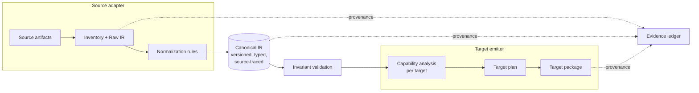

# ETLIR

**A canonical intermediate representation for traceable ETL modernization.**

ETLIR translates legacy ETL definitions into modern data platforms through a typed,
versioned **Canonical IR** that sits between independently developed **source adapters**
and **target emitters**. Every canonical entity and every generated artifact carries a
**source trace** back to the construct and rule that produced it. Constructs a target
cannot express are reported and blocked. They are never silently dropped or approximated.

[](https://github.com/shiva-carimireddy/etlir/actions/workflows/ci.yml)
[](LICENSE)

> **Project status: pre-alpha, research software.** The framework core (Canonical IR
> schema, invariants, capability analysis, plugin contracts, conformance kit) is
> implemented and tested. The first source/target pair (**PowerCenter XML → Apache
> Spark**) is under development; see [ROADMAP.md](ROADMAP.md). No translation-quality or
> performance results have been published yet. Do not rely on ETLIR for production
> migrations.

## Why ETLIR

Direct source-to-target converters couple parsing, interpretation, validation and code
generation in one pass. When output is wrong, it is hard to tell which stage failed, and
every new target means another converter. ETLIR separates these stages:


```mermaid
flowchart LR
  subgraph S[Source adapter]
    A[Source artifacts] --> B[Inventory + Raw IR]
    B --> C[Normalization rules]
  end
  C --> D[(Canonical IR<br/>versioned, typed,<br/>source-traced)]
  D --> E[Invariant validation]
  E --> F[Capability analysis<br/>per target]
  subgraph T[Target emitter]
    F --> G[Target plan] --> H[Target package]
  end
  B -. provenance .-> X[Evidence ledger]
  D -. provenance .-> X
  H -. provenance .-> X
```

* **Adding a source** does not change Canonical IR semantics or any target emitter.
* **Adding a target** does not change any source adapter.
* **Every stage writes an inspectable artifact** (inventory, Raw IR, Canonical IR,
  diagnostics, evidence, target plan), so failures can be localized and runs reproduced.
* **Capabilities fail closed.** A construct the target does not declare is blocked, and
  so is every task that depends on it.

These boundaries are enforced by tests, not by convention alone
([tests/test_boundaries.py](tests/test_boundaries.py)).

## Coverage

| Source ↓ / Target → | Apache Spark | Others |
|---|---|---|
| Informatica PowerCenter XML | In development (first reference pair) | Open for contribution |
| Others | Open for contribution | Open for contribution |

Construct-level support is declared in each emitter's capability manifest and published in
[docs/support-matrix.md](docs/support-matrix.md). A listed pair is supported only for the
constructs its manifest declares.

## Install

```bash
pip install etlir            # once released; until then:
git clone https://github.com/shiva-carimireddy/etlir && cd etlir
python -m venv .venv && . .venv/bin/activate      # Windows: .venv\Scripts\activate
pip install -e ".[dev]"
pytest
```

Requires Python 3.10+. The Spark target will additionally require a pinned
Java/PySpark environment, which will be supplied as a container.

```bash
etlir version                  # tool and Canonical IR versions
etlir plugins                  # installed source adapters and target emitters
etlir schema --out schemas/canonical
etlir validate canonical_ir.json
```

## Extending ETLIR

Source adapters and target emitters are ordinary Python packages discovered through entry
points, so they can live in this repository or be published independently
(`etlir-source-<name>`, `etlir-target-<name>`). Each must pass the
[conformance kit](src/etlir/testing/) before it is listed. Start with
[docs/extending.md](docs/extending.md) and [CONTRIBUTING.md](CONTRIBUTING.md).

## Documentation

* [Architecture](docs/architecture.md): stages, Canonical IR invariants, boundaries
* [Extending](docs/extending.md): writing a source adapter or target emitter
* [Claims policy](docs/claims-policy.md): the vocabulary ETLIR and its contributors use
  for support and correctness
* [Architecture decisions](docs/decisions/)
* [Limitations](docs/limitations.md)
* [Roadmap and acceptance gates](ROADMAP.md)

## Citing ETLIR

If you use ETLIR in research, cite the software using the metadata in
[CITATION.cff](CITATION.cff) (GitHub's "Cite this repository" button). Cite a **tagged
release** (and its archived DOI once available), not the moving `main` branch, so results
can be reproduced.

## License and trademarks

Licensed under the [Apache License, Version 2.0](LICENSE). See [NOTICE](NOTICE).

ETLIR is an independent project. It is not affiliated with, endorsed by, or sponsored by
Informatica, the Apache Software Foundation, or any other vendor whose products it reads
or targets. Product names are used only to identify file formats and platforms for
interoperability. Informatica and PowerCenter are trademarks of their respective owner.
Apache, Apache Spark and Spark are trademarks of the Apache Software Foundation.
