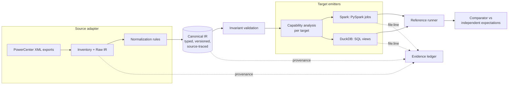

# ETLIR

**A canonical intermediate representation for traceable ETL modernization.**

ETLIR translates legacy ETL definitions into modern data platforms through a typed,
versioned **Canonical IR** that sits between independently developed **source adapters**
and **target emitters**. Every canonical entity and every generated line of code carries a
**source trace** back to the construct and rule that produced it. Constructs a target
cannot express are reported and **blocked**, never silently dropped or approximated.

[](https://github.com/shiva-carimireddy/etlir/actions/workflows/ci.yml)
[](LICENSE)

> **Status: 0.1.0 (alpha, research software).** The first reference pair, **Informatica
> PowerCenter XML → Apache Spark**, runs end to end for a documented subset, with a second
> target (**DuckDB**) generated from the same Canonical IR. Outside that subset, ETLIR
> reports and blocks instead of guessing. Do not use it for production migrations without
> your own validation. See [what works](#what-works-in-010) and
> [limitations](docs/limitations.md).

## How it works


```mermaid
flowchart LR
  subgraph S[Source adapter]
    A[PowerCenter XML exports] --> B[Inventory + Raw IR]
    B --> C[Normalization rules]
  end
  C --> D[(Canonical IR<br/>typed, versioned,<br/>source-traced)]
  D --> E[Invariant validation]
  E --> F[Capability analysis<br/>per target]
  subgraph T[Target emitters]
    F --> G[Spark: PySpark jobs]
    F --> H[DuckDB: SQL views]
  end
  G --> R[Reference runner]
  H --> R
  R --> K[Comparator vs<br/>independent expectations]
  B -. provenance .-> X[Evidence ledger]
  D -. provenance .-> X
  G -. file:line .-> X
  H -. file:line .-> X
```

* **Adding a source** does not change Canonical IR semantics or any target emitter.
  **Adding a target** does not change any source adapter. Tests enforce both.
* **Every stage writes an inspectable, deterministic artifact**: inventory, Raw IR,
  Canonical IR, validation, evidence, target packages, report.
* **Capabilities fail closed.** A construct a target does not declare is blocked, and so
  is every task that depends on it.

## Quickstart

```bash
git clone https://github.com/shiva-carimireddy/etlir && cd etlir
python -m venv .venv && . .venv/bin/activate      # Windows: .venv\Scripts\activate
pip install -e ".[dev]"                          # add ",spark" for the Spark target (Java 17+)

etlir convert benchmarks/cases/pc-orders/source --out out/orders
```

```
converted 2 file(s): 1 pipeline(s), 3 dataflow(s), operations mapped 20/20
  duckdb: dataflows emitted 3/3, tasks runnable 3/3
  spark: dataflows emitted 3/3, tasks runnable 3/3
artifacts: out/orders (open report.html)
```

Run the generated workflow and compare against expectations, for every included case:

```bash
etlir benchmark benchmarks/cases --out results/local --target duckdb   # no JVM needed
etlir benchmark benchmarks/cases --out results/local                   # duckdb + spark
```

Or step by step: `etlir run out/orders --target spark --bindings bindings.json`, then
`etlir compare …`. See [docs/reproduction.md](docs/reproduction.md).

Convert your own exports (all files of one repository/folder group together, so
cross-file references resolve):

```bash
etlir inspect path/to/exports/                 # inventory only
etlir convert path/to/exports/ --out out/mine  # every stage + report.html
```

## What works in 0.1.0

**PowerCenter subset** ([details](docs/sources/powercenter.md)): flat-file and relational
sources and targets; Source Qualifier including SQL overrides, source filters,
user-defined joins and SELECT DISTINCT (a SQLGlot-parsed subset, including Oracle `(+)`
joins and GROUP BY aggregates); connected and unconnected (`:LKP`) Lookups, including
SQL-override and range lookups; Expression (stateless variable ports), Filter, Router,
Joiner, Aggregator; row-aligned merges of several branches; mapping parameters and
run-constant mapping variables; sessions and workflows with success/failure/unconditional
links; cross-file resolution; a typed parser for a documented expression subset.

**Targets** ([details](docs/targets.md), [support matrix](docs/support-matrix.md)):
PySpark DataFrame jobs (`spark-submit`, Spark 4.2 / Java 17) and DuckDB SQL, both
executed by a reference workflow runner.

**Blocked with reasons:** Update Strategy, Sequence Generator, Normalizer, Sorter, Rank,
mapplets, dynamic lookup caches, SQL outside the accepted subset (subqueries, `SELECT *`,
…), stateful variables, command/email/event tasks, custom link conditions, and functions
outside the expression subset (`DECODE`, `TO_CHAR`, `LPAD`, date functions, …).

**Covered by the test suite:** secure XML loading (XXE and entity expansion rejected); Raw IR
preservation; byte-identical repeat conversions; conformance of both emitters; output
agreement with hand-authored expectations on both targets, including an
expression-semantics truth table; and semantic mutation analysis showing the comparator
catches wrong semantics.

## Extending ETLIR

Source adapters and target emitters are Python packages discovered through entry points,
in-tree or published separately (`etlir-source-<name>`, `etlir-target-<name>`). Each must
pass the [conformance kit](src/etlir/testing/). Start with
[docs/extending.md](docs/extending.md) and [CONTRIBUTING.md](CONTRIBUTING.md).

## Documentation

[Architecture](docs/architecture.md) · [Canonical semantics](docs/semantics.md) ·
[PowerCenter adapter](docs/sources/powercenter.md) · [Targets and runner](docs/targets.md)
· [Support matrix](docs/support-matrix.md) · [Extending](docs/extending.md) ·
[Claims policy](docs/claims-policy.md) · [Reproduction](docs/reproduction.md) ·
[Limitations](docs/limitations.md) · [Decisions](docs/decisions/) ·
[Roadmap](ROADMAP.md) · [Evaluation protocol](benchmarks/protocol.md)

## Citing ETLIR

Cite the tagged release you used, via [CITATION.cff](CITATION.cff) (GitHub's "Cite this
repository"), and its archived DOI when available, not the moving `main` branch.

## License and trademarks

Licensed under the [Apache License, Version 2.0](LICENSE). See [NOTICE](NOTICE).

ETLIR is an independent project. It is not affiliated with, endorsed by, or sponsored by
Informatica, the Apache Software Foundation, DuckDB Labs, or any other vendor whose
products it reads or targets. Product names identify file formats and platforms for
interoperability only. Informatica and PowerCenter are trademarks of their respective
owner. Apache, Apache Spark and Spark are trademarks of the Apache Software Foundation.
DuckDB is a trademark of its respective owner.
