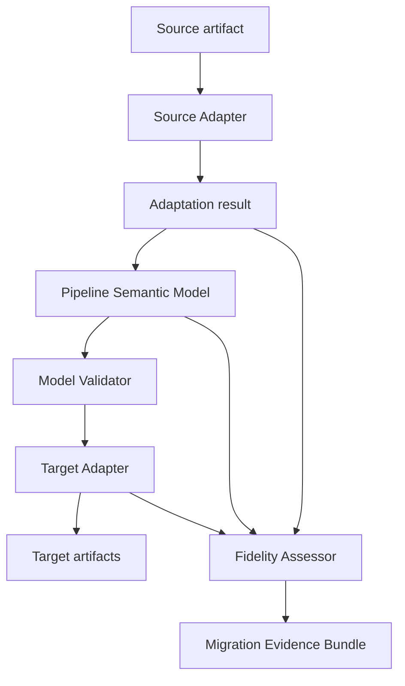

# Architecture

ETLIR separates the portable specification from adapters and from target execution. Its job ends
after it has created target artifacts and evidence describing the translation.

## Component flow

## Responsibilities

### Source Adapter

A Source Adapter reads one declared format and returns:

- A Pipeline Semantic Model document.
- A source-element inventory identifying every source operation considered.
- Structured diagnostics raised during adaptation.
- Source provenance such as adapter version and an artifact digest.

It must not execute embedded source code, query undeclared services, or discard an unrecognized
operation. If the artifact cannot be adapted safely, the adapter returns a diagnostic and no
model.

### Pipeline Semantic Model

The model represents declared pipeline behavior independently of any particular execution
engine. Version 0.1 includes datasets, a small expression tree, read/filter/derive/write
operations, external operations, directed edges, and source references.

The model is a semantic exchange contract, not a runtime plan. A model document can be valid even
when a particular target cannot implement it.

### Model Validator

Validation has two layers:

1. JSON Schema validation checks document shape, types, and allowed values.
2. Semantic validation checks cross-document invariants such as unique identifiers, valid
   references, and an acyclic operation graph.

This validation answers whether the model is well-formed. It does not answer whether target
behavior is equivalent.

### Target Adapter

A Target Adapter consumes a valid model and returns:

- Zero or more target artifacts.
- One translation record for every model operation.
- Diagnostics for unsupported, approximate, ambiguous, or manual behavior.

A target adapter performs a capability pass before generation. If a blocking condition exists,
the v0.1 reference implementation withholds runnable target output.

### Fidelity Assessor

The assessor validates accounting across the boundaries:

- Each inventoried source operation is referenced by a model operation or source diagnostic.
- Each model operation has exactly one target translation record or a blocking target diagnostic.
- Each record has an allowed disposition and the references required by that disposition.

The assessor does not prove mathematical or runtime equivalence. A `preserved` disposition means
that the adapter applied a declared, reviewable translation rule for that operation.

### Migration Evidence Bundle

The bundle records provenance, artifacts, operation dispositions, diagnostics, and a summary. The
JSON form follows a versioned schema. The Markdown form is a deterministic human-readable view of
the same evidence.

## Status derivation

| Condition | Overall status |
|---|---|
| All operations are preserved and no error diagnostics exist | `complete` |
| No errors exist, but at least one operation is approximate, ambiguous, or manual | `qualified` |
| Any unsupported or blocked disposition, error diagnostic, or accounting gap exists | `blocked` |

## Extension boundary

Third-party adapters are discovered through Python package entry points. The adapter API is part
of the reference implementation and may evolve independently of the model specification. An
adapter declares the model versions it accepts; it must refuse incompatible versions explicitly.

Future model extensions will use named namespaces and documented compatibility behavior. Version
0.1 deliberately does not accept arbitrary undeclared fields.

## Trust boundary

ETLIR handles pipeline descriptions as untrusted input. The core and built-in adapters operate
locally, do not fetch source URLs, and write only within a caller-selected output directory.
Generated code remains untrusted until reviewed and tested in the target environment.

